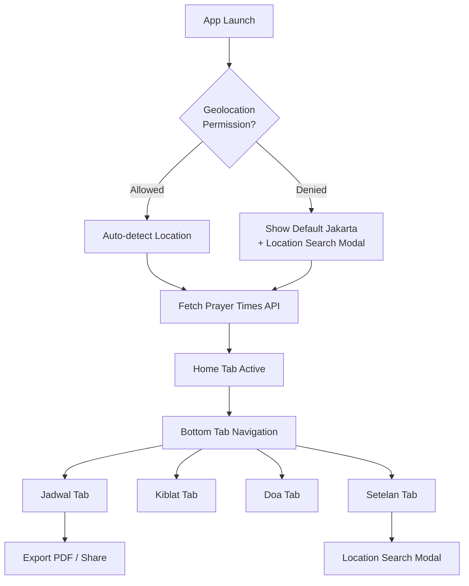

# Jadwal Sholat — UI/UX & Navigation Design

## Navigation Architecture

Aplikasi menggunakan **Single Page Application (SPA)** dengan **Bottom Tab Navigation** — pola yang familiar bagi pengguna mobile dan cocok untuk konten yang terbagi menjadi beberapa kategori utama.

### Bottom Tab Bar — 5 Tab Utama

```
┌──────────────────────────────────────────────────┐
│  🏠 Home    📅 Jadwal   🧭 Kiblat   📖 Doa   ⚙️ Setelan │
└──────────────────────────────────────────────────┘
```

| Tab | Icon (Lucide) | Konten Utama |
|-----|---------------|-------------|
| **Home** | `Home` | Hero section: jam digital, countdown, info lokasi, tanggal Hijriyah |
| **Jadwal** | `Calendar` | Tabel lengkap waktu sholat + export PDF + share |
| **Kiblat** | `Compass` | Kompas arah kiblat + info sudut |
| **Doa** | `BookOpen` | Koleksi doa harian + pencarian |
| **Setelan** | `Settings` | Dark mode, notifikasi, lokasi favorit, metode kalkulasi |

### Navigation Flow



---

## Design System

### Color Palette

Desain terinspirasi dari arsitektur Islam — menggunakan warna **teal/emerald** sebagai aksen utama dan **gold** sebagai aksen sekunder.

| Token | Light Mode | Dark Mode | Kegunaan |
|-------|-----------|-----------|---------|
| `--bg-primary` | `#F0F9F4` (mint cream) | `#0F1A1C` (deep dark teal) | Background utama |
| `--bg-card` | `rgba(255,255,255,0.7)` | `rgba(30,45,50,0.7)` | Card glassmorphism |
| `--accent` | `#0D9488` (teal-600) | `#2DD4BF` (teal-400) | Aksen utama, tab aktif |
| `--accent-glow` | `#14B8A6` | `#5EEAD4` | Glow effect, hover |
| `--gold` | `#D97706` (amber-600) | `#FBBF24` (amber-400) | Highlight waktu sholat aktif |
| `--text-primary` | `#1E293B` (slate-800) | `#F1F5F9` (slate-100) | Teks utama |
| `--text-secondary` | `#64748B` (slate-500) | `#94A3B8` (slate-400) | Teks pendukung |
| `--danger` | `#EF4444` | `#F87171` | Countdown < 15 menit |

### Typography

| Elemen | Font | Size | Weight |
|--------|------|------|--------|
| Jam Digital | `'JetBrains Mono'` | 56px / 3.5rem | 700 |
| Countdown | `'JetBrains Mono'` | 24px / 1.5rem | 600 |
| Heading Section | `'Inter'` | 20px / 1.25rem | 700 |
| Nama Sholat | `'Inter'` | 16px / 1rem | 600 |
| Waktu Sholat | `'JetBrains Mono'` | 16px / 1rem | 500 |
| Teks Arab (Doa) | `'Amiri'` | 24px / 1.5rem | 400 |
| Body Text | `'Inter'` | 14px / 0.875rem | 400 |

### Glassmorphism System

```css
/* Card Style */
.glass-card {
  background: var(--bg-card);
  backdrop-filter: blur(16px);
  border: 1px solid rgba(255,255,255,0.15);
  border-radius: 20px;
  box-shadow: 0 8px 32px rgba(0,0,0,0.08);
}
```

---

## Screen Wireframes

### 🏠 Tab 1: Home

```
┌──────────────────────────────────┐
│  ☀️ Jadwal Sholat          🌙    │  ← Navbar (dark mode toggle)
├──────────────────────────────────┤
│                                  │
│  ┌────────────────────────────┐  │
│  │  📍 Jakarta, Indonesia     │  │
│  │  17 Sya'ban 1447 H         │  │
│  │                            │  │
│  │      1 3 : 4 5 : 2 2      │  │  ← Jam digital besar
│  │                            │  │
│  │  ┌──────────────────────┐  │  │
│  │  │ 🕌 Ashar dalam       │  │  │  ← Next prayer badge
│  │  │    02 : 14 : 38      │  │  │  ← Countdown
│  │  └──────────────────────┘  │  │
│  └────────────────────────────┘  │  ← Hero glassmorphism card
│                                  │
│  Jadwal Hari Ini                 │
│  ┌────────────────────────────┐  │
│  │ ☁️  Imsak        04:32     │  │
│  │ 🌅 Subuh        04:42     │  │
│  │ ☀️  Terbit       05:58     │  │
│  │ 🌞 Dzuhur  ●    12:08     │  │  ← "●" = sedang berlangsung (gold)
│  │ 🌤️ Ashar   →    15:30     │  │  ← "→" = berikutnya (teal accent)
│  │ 🌅 Maghrib      18:01     │  │
│  │ 🌙 Isya         19:12     │  │
│  └────────────────────────────┘  │  ← Prayer list card
│                                  │
├──────────────────────────────────┤
│  🏠    📅    🧭    📖    ⚙️     │  ← Bottom tab bar
└──────────────────────────────────┘
```

### 📅 Tab 2: Jadwal (Schedule)

```
┌──────────────────────────────────┐
│  📅 Jadwal Sholat                │
├──────────────────────────────────┤
│                                  │
│  ◀ Kamis, 12 Feb 2026 ▶         │  ← Date navigation (swipeable)
│    17 Sya'ban 1447 H             │
│                                  │
│  ┌────────────────────────────┐  │
│  │ Waktu      │ Jadwal        │  │
│  │────────────┼───────────────│  │
│  │ Imsak      │ 04:32         │  │
│  │ Subuh      │ 04:42         │  │
│  │ Terbit     │ 05:58         │  │
│  │ Dzuhur  ●  │ 12:08         │  │
│  │ Ashar   →  │ 15:30         │  │
│  │ Maghrib    │ 18:01         │  │
│  │ Isya       │ 19:12         │  │
│  └────────────────────────────┘  │
│                                  │
│  ┌──────────┐ ┌──────────────┐  │
│  │ 📄 PDF    │ │ 📤 Bagikan   │  │  ← Action buttons
│  └──────────┘ └──────────────┘  │
│                                  │
├──────────────────────────────────┤
│  🏠    📅    🧭    📖    ⚙️     │
└──────────────────────────────────┘
```

### 🧭 Tab 3: Kiblat (Qibla)

```
┌──────────────────────────────────┐
│  🧭 Arah Kiblat                  │
├──────────────────────────────────┤
│                                  │
│         ┌─────────────┐          │
│        /    N          \         │
│       /       │         \        │
│      /        │          \       │
│     │    W ───┼─── E     │      │  ← SVG Compass rose
│      \     🕋↗          /        │  ← Qibla arrow (rotated)
│       \       │         /        │
│        \    S          /         │
│         └─────────────┘          │
│                                  │
│  ┌────────────────────────────┐  │
│  │  Arah Kiblat: 295.4°       │  │
│  │  Jarak ke Ka'bah: 8,567 km │  │
│  │  Koordinat Anda:            │  │
│  │  -6.2088°, 106.8456°       │  │
│  └────────────────────────────┘  │
│                                  │
│  ⓘ Putar perangkat agar panah   │
│    menunjuk ke arah Kiblat       │
│                                  │
├──────────────────────────────────┤
│  🏠    📅    🧭    📖    ⚙️     │
└──────────────────────────────────┘
```

### 📖 Tab 4: Doa

```
┌──────────────────────────────────┐
│  📖 Doa Harian                   │
├──────────────────────────────────┤
│  ┌────────────────────────────┐  │
│  │ 🔍 Cari doa...             │  │  ← Search bar
│  └────────────────────────────┘  │
│                                  │
│  ┌────────────────────────────┐  │
│  │ ▼ Doa Sebelum Tidur        │  │  ← Accordion (collapsed)
│  └────────────────────────────┘  │
│  ┌────────────────────────────┐  │
│  │ ▲ Doa Bangun Tidur         │  │  ← Accordion (expanded)
│  │                            │  │
│  │  اَلْحَمْدُ لِلَّهِ الَّذِيْ     │  │  ← Arabic (Amiri font)
│  │  أَحْيَانَا بَعْدَ مَا أَمَاتَنَا  │  │
│  │                            │  │
│  │  Alhamdu lillahil-ladzi    │  │  ← Latin transliteration
│  │  ahyana ba'da ma amatana   │  │
│  │                            │  │
│  │  "Segala puji bagi Allah   │  │  ← Indonesian translation
│  │   yang menghidupkan kami   │  │
│  │   setelah mematikan kami"  │  │
│  └────────────────────────────┘  │
│  ┌────────────────────────────┐  │
│  │ ▼ Doa Masuk Masjid         │  │
│  └────────────────────────────┘  │
│  ┌────────────────────────────┐  │
│  │ ▼ Doa Keluar Masjid        │  │
│  └────────────────────────────┘  │
│  ...                             │
│                                  │
├──────────────────────────────────┤
│  🏠    📅    🧭    📖    ⚙️     │
└──────────────────────────────────┘
```

### ⚙️ Tab 5: Setelan (Settings)

```
┌──────────────────────────────────┐
│  ⚙️ Setelan                      │
├──────────────────────────────────┤
│                                  │
│  Tampilan                        │
│  ┌────────────────────────────┐  │
│  │ 🌙 Mode Gelap      [====] │  │  ← Toggle switch
│  └────────────────────────────┘  │
│                                  │
│  Notifikasi                      │
│  ┌────────────────────────────┐  │
│  │ 🔔 Notifikasi Sholat [===]│  │  ← Toggle switch
│  │ ⏰ Pengingat 5 menit  [===]│  │  ← Toggle (before adhan)
│  └────────────────────────────┘  │
│                                  │
│  Lokasi                          │
│  ┌────────────────────────────┐  │
│  │ 📍 Jakarta, Indonesia      │  │  ← Current location
│  │ [🔍 Cari Lokasi Lain]      │  │  ← Opens search modal
│  └────────────────────────────┘  │
│                                  │
│  Lokasi Favorit                  │
│  ┌────────────────────────────┐  │
│  │ ⭐ Surabaya       [Pilih]  │  │
│  │ ⭐ Bandung        [Pilih]  │  │
│  │ ⭐ Yogyakarta     [Pilih]  │  │
│  └────────────────────────────┘  │
│                                  │
│  Metode Kalkulasi                │
│  ┌────────────────────────────┐  │
│  │ 🕌 Kemenag RI        [▼]  │  │  ← Dropdown select
│  └────────────────────────────┘  │
│                                  │
├──────────────────────────────────┤
│  🏠    📅    🧭    📖    ⚙️     │
└──────────────────────────────────┘
```

---

## Interaction Design & Micro-Animations

### Transisi Antar Tab
- **Fade + slide** (150ms ease-out) saat berpindah tab
- Tab aktif: ikon membesar 1.1x + label muncul di bawah ikon
- Tab tidak aktif: hanya ikon, warna `--text-secondary`

### Countdown Timer
- Angka berubah dengan efek **flip** (seperti jam bandara)
- Ketika < 15 menit: warna berubah ke `--danger` (merah) + **pulse animation**
- Ketika tepat waktu sholat: **full-screen glow** + notifikasi browser

### Hero Card
- Background gradient berubah sesuai waktu:
  - **Subuh** (04:00-06:00): gradient biru-ungu (dawn)
  - **Pagi** (06:00-12:00): gradient kuning-biru langit
  - **Siang** (12:00-15:00): gradient biru cerah
  - **Sore** (15:00-18:00): gradient oranye-ungu (sunset)
  - **Malam** (18:00-04:00): gradient biru gelap-hitam (night)

### Tabel Jadwal
- Baris sholat yang sedang berlangsung: **gold background glow** + pulse
- Baris sholat berikutnya: **teal left-border** tebal (4px)
- Hover: baris terangkat (translateY -2px) + shadow

### Kompas Kiblat
- Jarum kompas: rotasi **smooth** (CSS transition 300ms)
- Saat device orientation berubah: compass merespons realtime
- **Pulse ring** di sekitar jarum saat menghadap tepat ke Kiblat (±5°)

### Dark Mode Toggle
- **Smooth transition** 300ms pada semua warna
- Ikon berubah ☀️ → 🌙 dengan rotasi 360°
- Background pattern opacity berubah subtle

### Accordion Doa
- Expand/collapse dengan **slide-down** 200ms ease
- Content muncul dengan **fade-in** 150ms delay

---

## Responsive Breakpoints

| Breakpoint | Layout | Catatan |
|-----------|--------|---------|
| `< 640px` (Mobile) | Single column, full-width cards | Bottom tab bar visible, jam digital 48px |  
| `640-1024px` (Tablet) | 2-column grid untuk jadwal + compass | Tab bar tetap di bawah |
| `> 1024px` (Desktop) | Sidebar navigation (vertical) menggantikan bottom tab, content di tengah max-width 800px | Sidebar dengan labels |

### Desktop Sidebar Layout

```
┌────────┬──────────────────────────────────┐
│        │                                  │
│  🏠    │                                  │
│  Home  │                                  │
│        │         Main Content             │
│  📅    │         (max-width 800px)        │
│  Jadwal│         centered                 │
│        │                                  │
│  🧭    │                                  │
│  Kiblat│                                  │
│        │                                  │
│  📖    │                                  │
│  Doa   │                                  │
│        │                                  │
│  ⚙️    │                                  │
│ Setelan│                                  │
│        │                                  │
└────────┴──────────────────────────────────┘
```

---

## Modal Overlays

### Location Search Modal

```
┌──────────────────────────────────┐
│  ✕                        Cari  │
│  ┌────────────────────────────┐  │
│  │ 🔍 Ketik nama kota...      │  │  ← Debounced input (300ms)
│  └────────────────────────────┘  │
│                                  │
│  Hasil Pencarian:                │
│  ┌────────────────────────────┐  │
│  │ 📍 Surabaya, Jawa Timur   │  │  ← Tap to select
│  │ 📍 Surbakti, Sumatera...  │  │
│  │ 📍 Suriname               │  │
│  └────────────────────────────┘  │
│                                  │
│  [⭐ Simpan ke Favorit]         │
└──────────────────────────────────┘
```

### Notification Permission Dialog

```
┌──────────────────────────────────┐
│                                  │
│         🔔                       │
│  Izinkan Notifikasi Sholat?     │
│                                  │
│  Dapatkan pengingat otomatis    │
│  saat waktu sholat tiba.        │
│                                  │
│  ┌───────────┐ ┌─────────────┐  │
│  │  Nanti    │ │  Izinkan ✓  │  │
│  └───────────┘ └─────────────┘  │
└──────────────────────────────────┘
```

---

## Accessibility

- Semua ikon memiliki `aria-label`
- Tab navigation mendukung keyboard (`Tab` / `Arrow keys`)
- Kontras warna memenuhi WCAG 2.1 AA (4.5:1 untuk teks biasa)
- `prefers-reduced-motion` menghilangkan animasi untuk pengguna yang memintanya
- Font Arab (Amiri) right-to-left aligned dengan `dir="rtl"`
